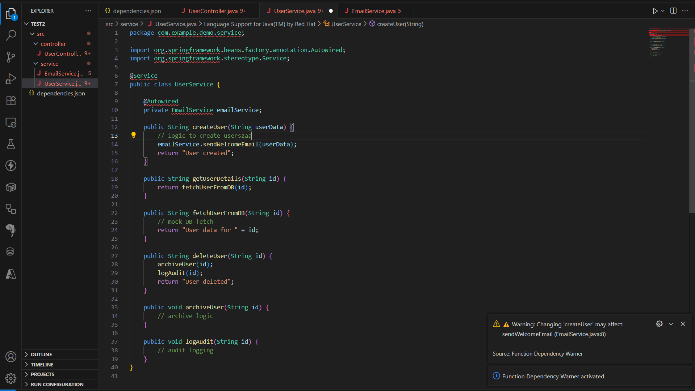

# Function Dependency Warner

[](https://marketplace.visualstudio.com/items?itemName=msaya.function-dependency-warner)
[](LICENSE.md)

> ⚠️ Warns developers when they're editing a function that has known downstream dependencies—minimizing the risk of unintended code breakage.

---

## ✨ Features

- 🔍 Detects when a user edits a function that has known dependent functions.
- ⚠️ Shows a warning if the function you're modifying may impact others.
- 📂 Reads a custom JSON-based dependency map (`dependencies.json`).
- 🧠 Ideal for large codebases or collaborative projects where function dependencies are critical.

---

## 📷 Demo


---

## 📦 Installation

1. Go to the [VS Code Marketplace](https://marketplace.visualstudio.com/items?itemName=msaya.function-dependency-warner)
2. Click **Install**
3. Reload VS Code if prompted

Or from VSIX:

```bash
code --install-extension function-dependency-warner-0.0.1.vsix
```

---

## ⚙️ Configuration

Add a path to your `dependencies.json` in VS Code settings:

### Via `settings.json`:
```json
"funcWarn.dependencyFile": "./dependencies.json"
```

> Default is `./dependencies.json` in the root of the workspace.

---

## 📁 Example `dependencies.json`

```json
{
  "saveUser": ["sendEmail", "logActivity"],
  "sendEmail": ["trackEmail"],
  "processOrder": ["updateInventory", "sendInvoice"]
}
```

If you now edit `saveUser`, the extension will show:

> ⚠️ Changing 'saveUser' may affect: sendEmail, logActivity

---

## 🛠️ How It Works

- Parses your configured dependency file.
- Listens for changes in text documents.
- Matches edited function names with the dependency map.
- Warns the developer when a dependent function may be affected.

---

## 🧪 Development

To build from source:

```bash
npm install
npm run compile
```

To package:

```bash
vsce package
```

To install the `.vsix` manually:

```bash
code --install-extension function-dependency-warner-0.0.1.vsix
```

---

## 📌 Known Limitations

> Now supports arrow functions, class methods, and static code analysis for function detection. Handles nested dependency structures.

---

## 📃 License

MIT © [Sayantan Mandal](https://github.com/sayantanmandal1)

---

## 💡 Ideas for Future

- Dependency auto-generation via static analysis
- Support for class methods, arrow functions, ES modules
- Hover or CodeLens showing dependents
- Integration with TypeScript type checker
